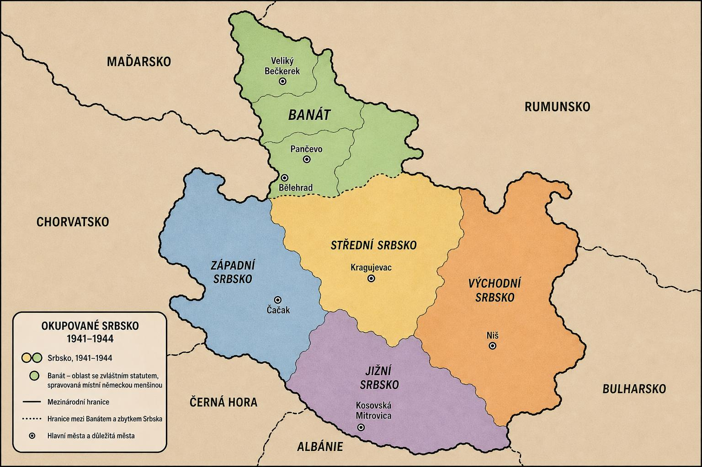

# JOGURTOSLÁVIE — Historická strategická hra (1941–1944)

<p align="center">
  
  <br>
  <em>Historická předloha herní mapy (1941–1944)</em>
</p>

Jogurtoslávie je tahová strategická a karetní hra, která hráče přenese do drsného prostředí odboje v Srbsku během druhé světové války. Staňte se vůdcem partyzánů, provádějte sabotáže a osvoboďte Bělehrad!

## Cíl hry
Vaším úkolem je **do konce 12. tahu osvobodit Bělehrad** (kontrola nad městem musí být ≥3) a zároveň plně **kontrolovat alespoň 2 další oblasti** (celkem tedy ≥3 osvobozené zóny). 

## Hlavní funkce

* **Interaktivní dynamická SVG mapa:** Hrací plocha je generována čistě pomocí SVG s vizuální zpětnou vazbou, barevným odlišením kontroly (od temně rudé nacistické okupace po zelenou svobodu).
* **Taktický karetní systém:** Během své fáze využíváte zdroje k hraní karet – od náboru bojovníků a cílené útoky až po sabotáže německých posádek.
* **Bohaté historické události:** Každý z 12 tahů je vázán na konkrétní historickou událost (např. Operace Strafgericht, pád Užické republiky, kapitulace Itálie), které mění stav hry a přidávají edukativní rozměr v přiloženém panelu "Historická fakta".
* **Automatizovaný Wehrmacht:** Německá "AI" v každém tahu logicky reaguje na vaše úspěchy – posiluje nejslabší zóny, provádí trestné výpravy do partyzánských oblastí a vyvíjí okupační tlak na civilní obyvatelstvo (snižuje morálku).

## Jak hru spustit lokálně
> **Upozornění:** Tento návod je **100% AI code**. Níže je odkaz na netlify pro přímé spuštění hry na počítači.

Jelikož je hra tvořena jako čistá React komponenta, můžete ji snadno začlenit do jakéhokoliv existujícího React projektu (např. pomocí Vite, Next.js nebo Create React App).

1. Vytvořte nový React projekt (doporučujeme Vite):

```bash
   npm create vite@latest jogurtoslavie -- --template react
   cd jogurtoslavie
   npm install

```

2. Zkopírujte soubor `jogurtoslavie.jsx` do složky `src`.
3. Upravte váš `App.jsx`, aby renderoval tuto komponentu:
```jsx
import Jogurtoslavie from './jogurtoslavie';

function App() {
  return <Jogurtoslavie />;
}
export default App;

```


4. Spusťte vývojový server:
```bash
npm run dev

```

## Pravidla (Stručný přehled)

Hra se skládá ze 12 tahů. Každý tah má 3 fáze:

1. **Fáze událostí:** Vyhodnotí se historická událost a aplikují se její efekty (ztráta morálky, zisk bojovníků, přísun zásob). Někdy dojde i k náhodné události.
2. **Německá fáze ("AI"):** Wehrmacht posílí posádky (garrison) tam, kde je zóna ohrožena, a zaútočí na oblasti s největším vlivem partyzánů.
3. **Vaše fáze:** Máte **2 akce**. Kliknutím na kartu a následně na oblast na mapě provádíte operace (útok, sabotáž...). Karty vyžadují *Zásoby*, útoky zase *Bojovníky*.

Prohrajete, pokud vaše **Morálka klesne na 0**, nebo pokud po 12. tahu nedržíte Bělehrad a 2 další oblasti.

## Licence

Upravujte a šiřte svobodně!

## Odkaz na Netlify
> pro spuštění hry přímo z počítače

https://jogurtoslavie.netlify.app/
